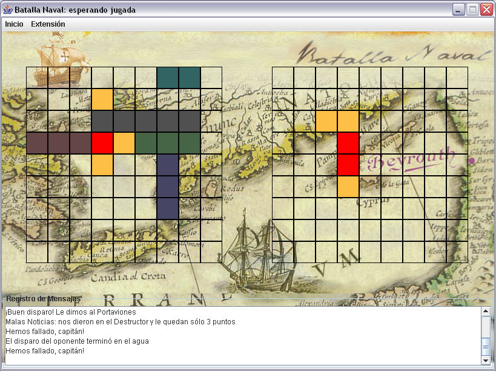

# Enunciado

El objetivo del ejercicio es construir un programa distribuido que permita a un
grupo de personas jugar por parejas “Batalla Naval”, permitiendo que cada una de
ellas juegue desde un computador distinto. Como un servicio adicional, el programa
debe almacenar información sobre los partidos perdidos y ganados de cada uno de los
participantes.

El juego se lleva a cabo sobre un tablero de 9 x 9 posiciones, en el que cada jugador
tiene situados 5 barcos (un partoviones, un destructor, dos fragatas y un submarino),
cada uno ocupando algunas de las casillas del tablero, dependiendo de su tamaño.

Al iniciar el juego el computador debe situar de manera aleatoria en el tablero la
flotilla de barcos de cada uno de los jugadores que va a participar en la batalla
(cada jugador conoce su tablero, pero no el del oponente). El objetivo del juego es
hundir todos los barcos del otro jugador. Para esto, en cada turno, uno de los
jugadores hace un disparo a una casilla del tablero oponente. El disparo puede caer al
agua o impactar alguno de los barcos contrarios. Para hundir un barco debe haber un
impacto sobre cada una de las casillas que lo componen. Uno de los jugadores comienza
el juego y se van turnando hasta que alguno de los dos haya logrado hundir la flota
del otro jugador. En todo momento un jugador tiene un tablero con sus barcos y los
disparos que le han hecho y otro tablero (llamado de ataque) con los barcos que ya ha
hundido y los disparos que ha hecho.

El programa distribuido debe constar de dos partes: un programa servidor, encargado
de mantener la información estadística del juego y de permitir a los jugadores
encontrarse para una partida, y un programa cliente, a través del cual un usuario
puede jugar “Batalla Naval”.

El programa cliente debe ofrecer las siguientes opciones al usuario:

1. Conectarse al servidor. Para esto el usuario debe suministrar su nombre, la
dirección IP del servidor al cual se quiere conectar y el puerto por el cual dicho
servidor se encuentra esperando conexiones.

2. Disparar sobre una casilla del tablero de ataque, en donde se encuentra la flota
naval del contrincante. Como respuesta a ésta acción, el programa debe informar si el
disparo dio en algún blanco o cayó al agua.

3. Visualizar el estado de la partida.

El programa servidor, por su lado, debe esperar a que los jugadores se vayan
conectando y, por cada pareja que pueda armar, inicia un encuentro. Además, el
servidor debe ofrecer las siguientes opciones sobre su interfaz de usuario:

1. Mostrar el estado de todos los partidos que se encuentren en el curso.

2. Mostrar las estadísticas históricas del juego. Allí debe aparecer el nombre
de cada jugador que haya participado en un encuentro, con el número de batallas
que ha ganado, el número de batallas que ha perdido y el porcentaje de victorias
que tiene en su historia de juegos.

Un programa cliente se puede encontrar en cuatro estados posibles:

1. Desconectado del servidor.

2. Conectado al servidor y esperando a que llegue un oponente.

3. Jugando un encuentro y con el turno de disparar.

4. Jugando un encuentro y esperando a que el contrincante haga su jugada.

La información histórica del juego debe ser persistente, de manera que cada vez
que se ejecute de nuevo el servidor, los datos estadísticos deben aparecer en
la ventana.

# Interfaz

    Ventana Principal del Cliente

    Ventana Principal del Servidor
